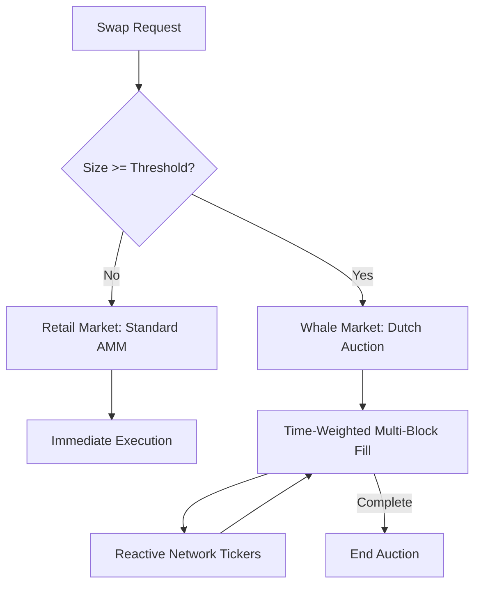

# TideHook — Project Brief
> Read this first. This is the full context an AI agent needs to build this project.

---

## What Is TideHook?

TideHook is a **Uniswap v4 hook** submitted to the **UHI8 Hookathon (2026)** under the **Specialized Markets** prize track.

It creates a **dual-market liquidity system inside a single Uniswap v4 pool** — one market for retail traders, one for whales — using Dutch auction-style time-weighted execution for large orders.

---

## The Problem

Whales ($500K+ trades) face brutal slippage on standard AMMs:
- Standard AMM: **3–5% slippage** on a $5M swap = $150K–$250K lost per trade
- OTC desks: charge **1–3% fees** and require trust
- No on-chain AMM solution built for institutional-scale execution
- Large orders also **front-run by MEV bots** the moment they're visible

---

## The Solution

TideHook creates **two parallel markets in one pool**, detected automatically by trade size:



### Retail Market (`< WHALE_THRESHOLD`, e.g. $500K)
- Standard AMM behavior
- Normal fee tier (e.g. 0.3%)
- No changes to UX or execution

### Whale Market (`>= WHALE_THRESHOLD`)
- **Dutch auction mechanism** — price starts at market rate and decays per block
- **Time-weighted execution** — large order fills gradually over multiple blocks
- Specialized LPs earn higher fees for providing deep liquidity
- MEV bots cannot profitably sandwich (price moves against them over time)

### Example
- $5M USDC→ETH on standard AMM: 3.2% slippage = **$160,000 lost**
- $5M USDC→ETH on TideHook: 0.2% effective slippage = **$10,000** — saving $150,000

---

## The MEV Narrative

Large swaps in standard AMMs are a magnet for MEV extraction. TideHook significantly reduces these opportunities:
- **Sandwich Attack Resistance:** By routing whales into a multi-block auction, the price discovery is gradual. MEV bots cannot profitably bundle the swap in a single block without taking huge exposure to the auction's predictable price decay.
- **Controlled Price Discovery:** Instead of a sudden price spike that triggers arbitrage bot cascades, TideHook smooths the price adjustment over time.
- **No Mempool Racing:** The Reactive Network acts as a trustless ticker, ensuring auction slices are processed based on block time, not gas wars.

## LP Protection & Benefits

TideHook isn't just for traders — it's a defensive tool for Liquidity Providers:
- **Inventory Smoothing:** Sudden 20% price jumps from a whale swap often leave LPs with toxic inventory. TideHook allows LPs to adjust their positions as the whale's order fills gradually.
- **Toxic Flow Mitigation:** By forcing large trades through an auction, TideHook ensures that "informed" whale flow is priced fairly over time, reducing impermanent loss for passive LPs.
- **Segmented Yield:** LPs in TideHook pools can capture higher fees from whale auctions (higher `whaleFeeBps`) compared to the competitive retail market.

---

## Technical Architecture

### Hook Permissions
| Hook | Purpose |
|---|---|
| `afterInitialize` | Register pool config, whale threshold, auction parameters |
| `beforeSwap` | Detect size, route to correct market, set dynamic fee |
| `afterSwap` | Update auction fill progress, settle completed auctions |

### Core Data Structures
```solidity
struct WhaleAuction {
    address whale;
    bool zeroForOne;
    uint256 totalAmount;
    uint256 filledAmount;
    uint256 startSqrtPriceX96;  // price at auction start
    uint256 priceDecayPerBlock; // how fast price decays
    uint256 startBlock;
    uint256 durationBlocks;     // e.g. 300 blocks (~1 hour)
    bool active;
    bool settled;
}

struct TideConfig {
    uint256 whaleThreshold;     // e.g. 500_000e6 (USDC)
    uint256 auctionDuration;    // blocks (default: 300)
    uint24 whaleFeeBps;         // e.g. 100 basis points (1%)
    uint24 retailFeeBps;        // e.g. 30 basis points (0.3%)
}
```

### Key Functions
- `beforeSwap(...)` — detects trade size; retail passes through, whale triggers auction
- `_initiateWhaleAuction(...)` — sets up Dutch auction struct for large order
- `_executeAuctionSlice(...)` — fills a portion of large order at current auction price
- `afterSwap(...)` — advances auction state, settles when fully filled
- `tickAuction(bytes32 auctionId)` — called by Reactive Network to advance auction per block
- `getAuctionPrice(bytes32 auctionId)` — view: current auction price based on decay

### Reactive Network Integration
- Reactive smart contract subscribes to `WhaleAuctionStarted` events
- Every N blocks, triggers `tickAuction(auctionId)` on TideHook to advance price decay
- This enables trustless time-weighted execution **without keeper bots or centralized infrastructure**
- Reactive is the **auction clock** — core to the architecture

---

## Hackathon Context

- **Event:** UHI8 Hookathon 2026
- **Theme:** Specialized Markets — specifically "Large-Cap Execution: hooks for large market cap pairs that handle block-based execution or segmented order flow"
- **Sponsor integrations:** Reactive Network ✅ + Unichain ✅
- **Submission name:** TideHook
- **Submitter:** crypticdev (gbangbolaphilip@gmail.com, Discord: .cryptic_dev)
- **Prize targets:** UHI8 Specialized Markets + Reactive Network sponsor prize + Unichain sponsor prize

---

## Tech Stack

- **Language:** Solidity 0.8.26+
- **Framework:** Foundry
- **Base class:** `BaseHook` from `@uniswap/v4-periphery/src/utils/BaseHook.sol`
- **Chain:** Unichain Sepolia (testnet), Unichain mainnet
- **Reactive:** Reactive Network reactive smart contracts (auction ticker)
- **EVM version:** Cancun

---

## File Structure to Build

```
TideHook/
├── src/
│   ├── TideHook.sol               # Main hook contract
│   ├── interfaces/
│   │   └── ITideHook.sol          # Hook interface
│   └── libraries/
│       └── AuctionMath.sol        # Dutch auction price decay math
├── reactive/
│   └── TideReactive.sol           # Reactive Network auction ticker
├── script/
│   └── DeployTideHook.s.sol       # Deployment script
├── test/
│   └── TideHook.t.sol             # Foundry tests
├── foundry.toml
└── remappings.txt
```

---

## What Needs to Be Built

1. **`TideHook.sol`** — main hook (size detection in beforeSwap, dual-market routing, auction lifecycle)
2. **`AuctionMath.sol`** — Dutch auction price decay calculation (linear or exponential decay)
3. **`ITideHook.sol`** — clean interface
4. **`TideReactive.sol`** — Reactive Network contract that subscribes to `WhaleAuctionStarted` and calls `tickAuction()` every N blocks
5. **`DeployTideHook.s.sol`** — Foundry deploy script
6. **`TideHook.t.sol`** — unit tests covering: retail swap unaffected, whale swap triggers auction, price decay correctness, auction settlement, slippage comparison

---

## Key Design Constraints

- Retail swaps MUST execute at standard speed with zero extra latency
- Whale threshold should be configurable by pool owner at initialization
- Dutch auction decay rate must be carefully calibrated (too fast = no execution, too slow = no benefit)
- Reactive callback must be authenticated (only Reactive Network address can call `tickAuction`)
- Auction must have a fallback settlement if Reactive callback is delayed (e.g. manual `tickAuction` with a time lock)
- Intercepted whale swaps are settled via **ERC6909 claims** to preserve `PoolManager` accounting invariants and prevent liquidity disruption during multi-tick settlement.
- Use `LPFeeLibrary` for dynamic fee override in `beforeSwap`

---

## Dutch Auction Math Reference

Price at block B:
```
currentPrice = startPrice - (priceDecayPerBlock * (B - startBlock))
```
Where decay is bounded: `currentPrice >= minPrice` (e.g. 5% below start).

Fill amount per tick: proportional slice of `totalAmount` spread over `durationBlocks`.
